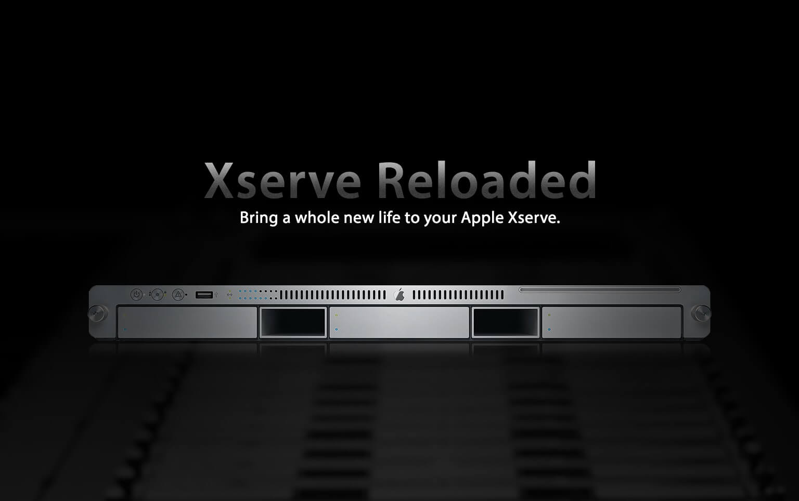

# Xserve Reloaded

**Xserve Reloaded** – The Xserve was the Apple server until November 5, 2010 that
was officially discontinued, offering as an alternative the Mac Mini Server or the
Mac Pro, but none of these machines are designed with server-grade hardware in
mind and are not a real replacement.

The latest model of the Xserve received software updates up to OS X El Capitan, however
from Mac OS X Lion the Xserve received the same OS used on the other Macs, a more
user-oriented operating system rather than a server-oriented operating system, eliminating
all the server tools and replacing them with the weak "Server.app" application.

Xserve Reloaded, seeks to give a new life to the Xserve giving the possibility of
installing the latest versions of macOS and bringing back part of the server-oriented
functionality lost in previous versions.

## Included Packages
### macOS Sierra Patcher
macOS Sierra Patcher is an easy-to-use tool that allows anyone to install macOS Sierra
on unsupported Macs.

### macOS High Sierra Patcher
macOS High Sierra Patcher, the successor to macOS Sierra Patcher, is an easy-to-use
tool that allows anyone to install macOS High Sierra on unsupported Macs, also adds
support for APFS drives.

### Xserve LOM Configurator
Xserve LOM Configurator, allows you to configure the Xserve's Lights Out Management ports
from a modern macOS installation.

### Server Tools
All the official Apple applications from the Server Tools package directly from OS X Snow
Leopard Server, has been patched and modified in order to work in newer versions of macOS.

### Xgrid
Xgrid is a program and distributed computing protocol that allows networked computers to
contribute to a single task. When the initiating computer sends the complete instructions,
or job, for processing to the controller, the controller splits the task up into these small
instruction packets, known as tasks.

### NVMe, USB 3 & SATA 3 Drivers
Add support for third-party NVMe Drives, USB 3 and SATA 3 PCI-E cards, adding Xserve
support to the latest standards and connectivity protocols.

## Compatibility
**Xserve Reloaded** is fully compatible with the following configurations:
- Xserve 2,1 running macOS 10.12 (macOS Sierra)*
- Xserve 2,1 running macOS 10.13 (macOS High Sierra)*
- Xserve 3,1 running macOS 10.12 (macOS Sierra)
- Xserve 3,1 running macOS 10.13 (macOS High Sierra)

###### * Requires a graphics card upgrade to a Nvidia GT 120 or better.

## Copyright
- Copyright (c) 2016-2018 [dosdude1](http://dosdude1.com/)
- Copyright (c) 2016-2018 [Pixeleyes Ltd.](http://www.pixeleyes.co.nz)
- Copyright (c) 2015-2018 [MinnowStor](https://forums.macrumors.com/members/jimj740.832671/)
- Copyright (c) 2013-2018 [Zenith432](https://sourceforge.net/u/zenith432/profile/)
- Copyright (c) 2012-2018 [Intel Corporation](https://www.intel.com)